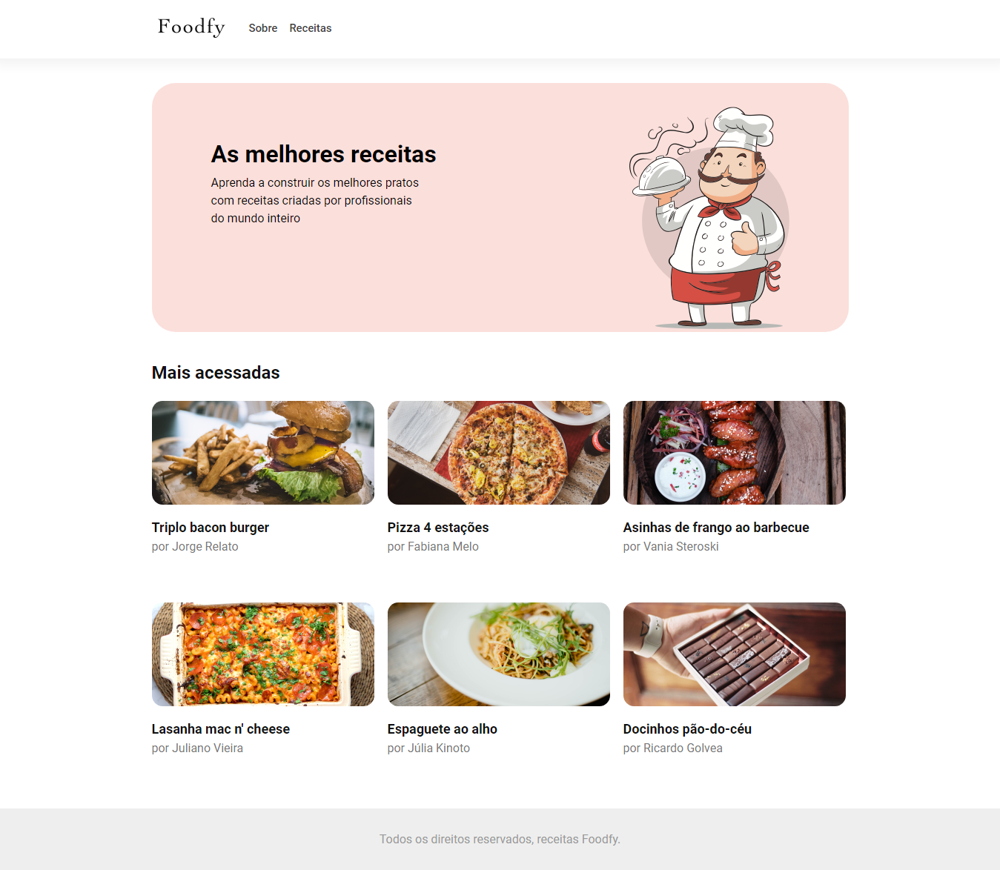

# foodfy


If you want to take a look on all screens of the application, they are [here](https://drive.google.com/drive/folders/102CEHvOE-kIf56JeUnbTzQC8qDwlvDce?usp=sharing).

## About this project

The idea of the application is:

_"Create a database of great recipes to new cookers."_

## Why?

This project is part of my personal portfolio, it was developed as a challange, I saw that in one of many Ignite's classes, provided by Rocketseat, they developed this application, so, I'll be happy if you could send me any feedback about the project, code, structure or anything that you can report that could make me better as a developer!

Reach me at: bwesleysouza@gmail.com

Connect with me at [LinkedIn](https://www.linkedin.com/in/bwesleysouza).

And you can use this project as you wish!

## Some Observations about this App

1 - The project isn't finished! I'll continue it...

## Getting started

### Prerequisites

To run this project in the development mode, you'll need to have NodeJS that can be found [here](https://nodejs.org/en/).

### Installing

**Cloning the Repository**

```
$ git clone git@github.com:SouzaWesley/foody.git

$ cd foodfy
```

**Installation dependencies**

```
$ yarn install
```

_or_

```
$ npm install
```

### Running

With all dependencies installed, you can now run the application:

```
$ npm run dev
```

```
$ yarn dev
```

The project will be locate at the port **localhost:3000**

## Build with

- [Express](http://expressjs.com/) - Complements NodeJS with some web application features
- [Nodemon](https://nodemon.io/) - Reloads the application
- [EJS](https://ejs.co/) - Used to let JavaScript's code in HTML 

## Contribuing

It was developed by me as a challange. **It's not finished**. I'll be glad to receive any feedback about something that a I need to redo. And if you have any question....

Reach me at: bwesleysouza@gmail.com

_or_

Try it: [LinkedIn](https://www.linkedin.com/in/bwesleysouza)

Thank you!

## License

This project is licensed under the MIT License - see the [LICENSE.md](./LICENSE.md) file for details.
